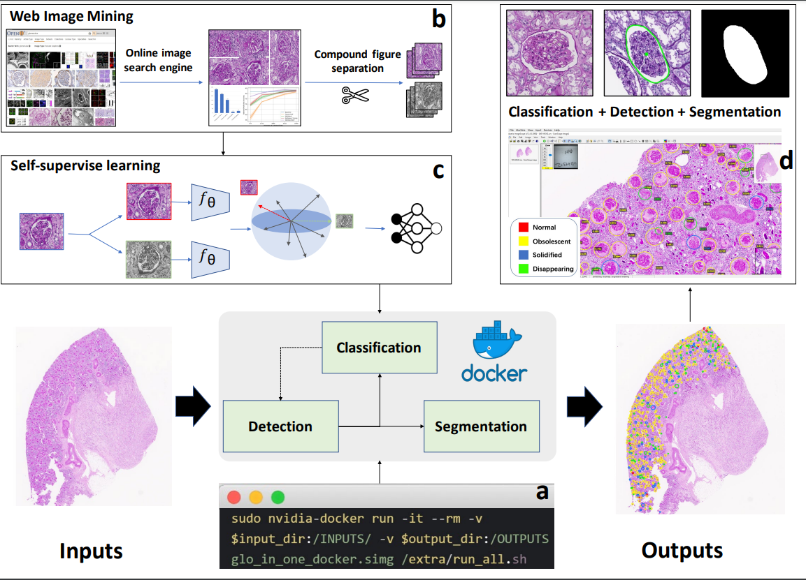

# Glo-In-One: Holistic Glomerular Detection, Segmentation, and Lesion Characterization with Large-scale Web Image Mining
The official implementation of Glo-In-One

 

## Abstract
The quantitative detection, segmentation, and characterization of glomeruli from high-resolution whole slide imaging (WSI) play essential roles in the computer-assisted diagnosis and scientific research in digital renal pathology. Historically, such comprehensive quantification requires extensive programming skills in order to be able to handle heterogeneous and customized computational tools. To bridge the gap of performing glomerular quantification for non-technical users, we develop the Glo-In-One toolkit to achieve holistic glomerular detection, segmentation, and characterization via a single line of command. Additionally, we release a large-scale collection of 30,000 unlabeled glomerular images to further facilitate the algorithmic development of self-supervised deep learning. The inputs of the Glo-In-One toolkit are WSIs, while the outputs are (1) WSI-level multi-class circle glomerular detection results (which can be directly manipulated with ImageScope), (2) glomerular image patches with segmentation masks, and (3) different lesion types. In the current version, the fine-grained global glomerulosclerosis (GGS) characterization is provided, including assessed-solidified (S-GGS, associated with hypertension-related injury), disappearing (D-GGS, a further end result of the SGGS becoming contiguous with fibrotic interstitium), and obsolescent (O-GGS, nonspecific GGS increasing with aging) glomeruli.

## Installation

Please refer to [INSTALL.md](docs/INSTALL.md) for installation instructions of the detection phase.

## Model
Pretrained model can be found [here](https://drive.google.com/drive/folders/1AhvNaoB7delzgznm4dLkkvZmGipCQShd?usp=sharing).

## Data
The collected glomerulus from web imaging for self-supervised learning can be found [here](https://data.mendeley.com/datasets/rpbz266jn9/1).

## Glo-In-One - Image Demo

For glomerulus detection, run 

```
python run_detection.py circledet --load_model ../model/detection_model.pth --filter_boarder --demo ../demo.svs --demo_dir ../output
```

For lesion characterization, run

```
python generate_patches.py ../demo.svs ../output
python filter_patches_5c.py --case ../demo.svs --output_dir ../output --checkpoint ../model/classifier_model.pth.tar
python filter_xml_5c.py  ../demo.svs ../output
```

For generating segment mask, run

```
python segmentation.py --rootdir ../output --wsi ../demo.svs --model ../model/segmentation_model.pth
```

### Quick start

#### Get our docker image

```
sudo docker pull 
```
#### Run Glo-In-One
You can run the following command or change the `input_dir`, then you will have the final segmentation results in `output_dir`
```
# you need to specify the input directory
export input_dir=/home/input_dir   
# make that directory
sudo mkdir $input_dir
#run the docker
sudo nvidia-docker run -it --rm -v $input_dir:/INPUTS/ -v $output_dir:/OUTPUTS 
```
